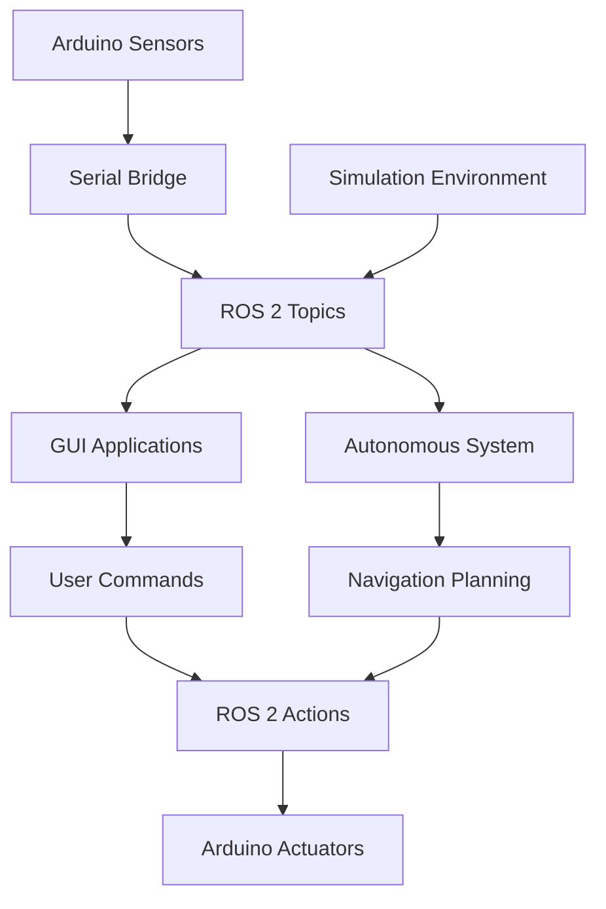

# 🚀 University Rover Challenge - Pitt Robotics

> **Advanced Autonomous Rover System for University Rover Challenge**  
> *ROS 2 • Python • Arduino • Docker • Computer Vision*


## 🎯 Project Overview

Complete software stack for the **University of Pittsburgh's University Rover Challenge (URC) Rover**. This system integrates advanced robotics technologies to compete in one of the most prestigious collegiate robotics competitions.

### 🏆 Competition Tasks
- **🚶 Autonomous Navigation** - GPS-guided traversal of challenging terrain
- **🎯 Equipment Servicing** - Precise manipulation tasks with robotic arm
- **📦 Extreme Delivery** - Package delivery in harsh environments  
- **🔬 Science Operations** - Sample collection and analysis
- **🕹️ Teleoperation** - Manual control for complex scenarios

## ⚡ Quick Start

### 🐳 Docker Setup (Recommended)

**macOS Development:**
```bash
cd docker/local
chmod +x start_mac.sh
./start_mac.sh
```

**Jetson/Linux Deployment:**
```bash
cd docker/jetson  
chmod +x start.sh
./start.sh
```

**Simulation Mode:**
```bash
cd docker/local
./sim-launch.sh
```

### 🤖 Launch Rover System

```bash
# Start main control interface
python3 guis/gen_gui.py

# Launch specific subsystems
python3 guis/arduino_gui.py      # Hardware communication
python3 guis/auto_gui.py         # Autonomous navigation
python3 guis/equip_serv_gui.py   # Equipment servicing
```

## 🏗️ System Architecture

### **Core Components**

```
🌐 ROS 2 Network Layer
├── 📡 Sensor Bridges (GPS, IMU, Cameras)
├── 🎮 Control Interfaces (Teleop, Autonomous)
├── 🤖 Hardware Abstraction (Motors, Servos)
└── 📊 Data Processing (Computer Vision, Navigation)

🖥️ GUI Control System  
├── 🎛️ General Control Dashboard
├── 🚗 Motor Control Interface
├── 🧭 Navigation & Mapping
└── 📸 Camera Feed Management

🔧 Hardware Integration
├── ⚡ Arduino Communication
├── 📶 Serial Protocol Bridges
├── 🎯 Motor Control Systems
└── 📡 Sensor Data Acquisition
```

### **Data Flow Architecture**



## 🛠️ Development Workflow

### **ROS 2 Development**

```bash
# Build ROS workspace
cd simulation/colcon_ws
colcon build

# Launch robot simulation
ros2 launch my_robot_description display.launch.py use_sim_time:=true

# Control with keyboard
ros2 run teleop_twist_keyboard teleop_twist_keyboard --ros-args -r /cmd_vel:=/teleop_cmd_vel

# Monitor system status
ros2 run rqt_console rqt_console
```

### **Git Workflow**
```bash
# Create feature branch
git fetch
git checkout -b feature/your-improvement

# Development cycle
git add .
git commit -m "feat: add autonomous navigation improvements"
git push origin feature/your-improvement

# Create pull request for review
```

## 📊 Technology Stack

### **🤖 Robotics & Control**
- **ROS 2 Humble** - Robot operating system
- **Gazebo** - Physics simulation environment
- **OpenCV** - Computer vision processing
- **PyQt5** - GUI framework for control interfaces

### **🔧 Hardware Integration**
- **Arduino** - Embedded sensor/actuator control
- **Serial Communication** - Hardware abstraction layer
- **NVIDIA Jetson** - Edge computing platform
- **GPS/IMU Sensors** - Navigation and localization

### **🚀 DevOps & Deployment**
- **Docker** - Containerized development environment
- **Docker Compose** - Multi-service orchestration
- **Make** - Build automation and cleanup

## 🎮 Competition Features

### **🧠 Autonomous Navigation**
- GPS-waypoint following
- Obstacle detection and avoidance  
- Terrain analysis and path planning
- Real-time localization and mapping

### **🎯 Precision Control**
- Robotic arm manipulation
- Equipment servicing protocols
- Sample collection automation
- Fine motor control systems

### **📡 Communication Systems**
- Long-range telemetry
- Video streaming capabilities
- Emergency stop protocols
- Multi-operator interface support

## 📈 Performance Metrics

- **Navigation Accuracy**: ±2m GPS positioning
- **Video Latency**: <200ms streaming
- **Control Response**: <50ms command execution
- **Battery Life**: 4+ hours autonomous operation
- **Operating Range**: 1km+ radio communication

## 🔍 Diagnostics & Monitoring

```bash
# System health check
./ros2_quick_diagnostic.sh

# Network connectivity
./udp_connectivity_test.py  

# Hardware status
python3 guis/gen_gui.py  # View sensor dashboard

# Log analysis
tail -f *.log
```

## 🏆 Competition History

- **2024 Season**: Advanced autonomous navigation implementation
- **Current Focus**: Computer vision improvements and manipulation tasks
- **Target**: Top 10 finish at University Rover Challenge

## 📚 Learning Resources

- [ROS 2 Documentation](https://docs.ros.org/en/humble/)
- [University Rover Challenge Rules](http://urc.marssociety.org/)
- [Computer Vision Tutorials](opencv-tutorials/)
- [Docker Best Practices](docker-best-practices/)

For detailed development guidance, see [CLAUDE.md](./CLAUDE.md).

---

**Team**: University of Pittsburgh Robotics Club  
**Competition**: [University Rover Challenge](http://urc.marssociety.org/)  
**Status**: Active Development - 2024 Season
